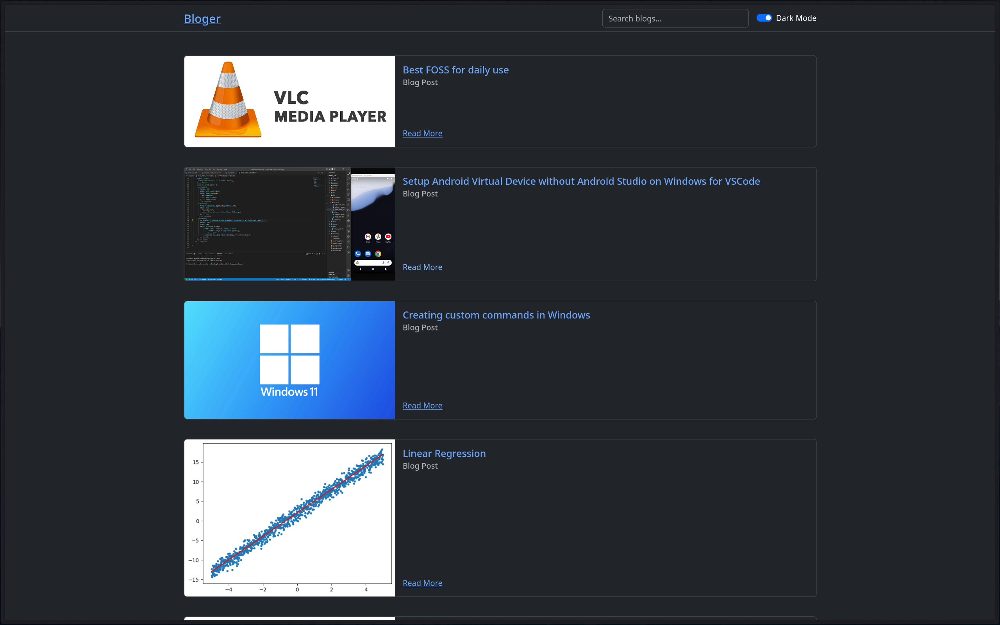

# Bloger

A program for simple blogging.
Converts Markdown Blogs in a simple folder into an optimized and responsive static site in pure HTML, CSS and JavaScript.

## Features

- Easy Markdown to HTML Conversion
- Easy and Versatile Configuration
- Simple and fully configurable website template
- Built in Search
- Built in Source code highlighting using highlight.js
- Simple default templates using bootstrap

[TO BE IMPLEMENTED]

- Image Compression and Lazy Loading for better loading times
- Tags for recommendations and grouping
- "Series" for grouping blogs as needed with a separate page
- Configuration using JSON
- Projects for multiple sites on the same machine
